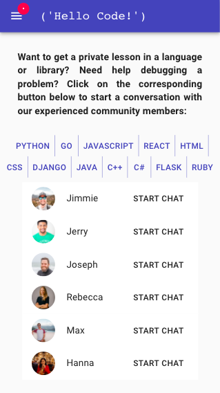
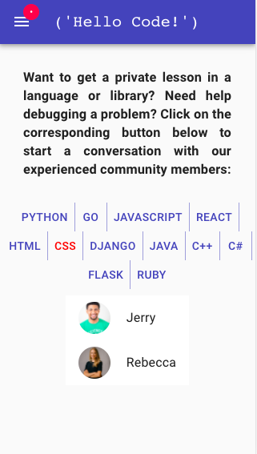
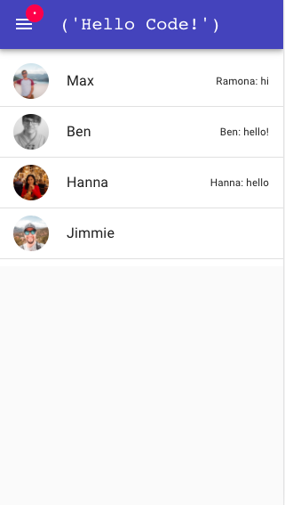

###  General Assembly, Software Engineering Immersive


# HelloCode™

## Table of Contents
1. [Overview](#Overview)
2. [Brief](#Brief)
3. [Technologies Used](#Technologies-Used)
4. [Django Channels](#Django-Channels-(Chat-App))
    - [Backend](#Backend)
    - [Frontend](#Frontend)
5. [HelloCode App](#HelloCode-App)
    - [Models](#Models)
6. [JWT Auth App](#JWT-Auth-App)
7. [Screenshots](#Screenshots)
8. [Challenges](#Challenges)
9. [Potential Future Features](#Potential-Future-Features)
10. [Lessons Learned](#Lessons-Learned)


# Overview
This was a week-long group project at General Assembly London by [Fortuny Carrega](https://github.com/IAmNini) , [Alexandra Galitzine](https://github.com/bili-bu), [Ben Harris](https://github.com/benharris8) and [Hanna Truong Thi](https://github.com/hvan307).

We wanted to create a chat app with a mobile-first design that allows programmers to connect with each other based on a language, or a framework they're interested to explore and exchange information on.

This is a full-stack application using Python Django (Django REST Framework, Channels) and React.js with Material-UI framework.

### My contributions
- Backend:
    * Profile picture functionality
- Front-end components:
    * Register.js
    * Login.js
    * auth.js
    * NavbarDrawer.js (jointly)
    * app.js (jointly)

# Brief
- Build a full-stack application
- Use a Python Django API (using Django REST Framework to serve your data from a Postgres database)
- Consume your API with a separate front-end (built with React)
- Be a complete product which most likely means multiple relationships and CRUD functionality for at least a couple of models
- Implement thoughtful user stories/wireframes

# Technologies Used
- Python
- Django
- Django Channels
- Redis
- PostgreSQL
- MySQL
- JavaScript (ES6)
- React.js
- CSS and SASS
- HTML
- Git and GitHub
- Heroku
- Insomnia
- Material-UI
- Google Fonts
- Trello

# Django Channels (Chat App)

## Backend
The websocket request comes into the Django backend and gets directed to the project routing.py.
From there if it is a websocket it gets directed to the chat app routing.py where the url is checked for the room name and is then directed to the ChatConsumer where the socket requests will be dealt with.

In ChatConsumer there are various helper functions in order to make handling the different requests easier. 
From the front end websocket requests the backend will always expect a ‘command’ field in the request data. This command is what tells the backend which function to run based on a list of accepted functions called commands. 

This is what a typical request from the front end looks like.
```js
{
  'command': 'fetch_messages', 
  'username': 'Ben', 
  'chatId': '1'
}
```
The request first comes into the receive function automatically due to the default setup of django channels. Receive just turns the initial data into JSON and passes it to a function decided by reading the command in the request.
In this case the fetch_messages function will take the chatId and feed it to a helper function written in the chat views.py file (which is imported at the top of consumers).
```py
def get_last_10_messages(chatId):
  chat = get_object_or_404(Chat, id=chatId)
  return chat.messages.order_by('-timestamp').all()[:10]
```
This function accesses the Messages model of the database and will return all the messages where the chatId matches the chatId passed into the function thereby returning all messages related to that specific chat. The function then bundles them up and turns them unto JSON with helper functions written inside the consumer (messages_to_json and message_to_json), then uses the send_chat_message function to send the messages back to the frontend. 
```py
def messages_to_json(self, messages):
  result = []
  for message in messages:
    result.append(self.message_to_json(message))
  return result

def message_to_json(self, message):
  return {
    'id': message.id,
    'author':message.author.username,
    'content':message.content,
    'timestamp': str(message.timestamp)
  }
```
```py 
def send_chat_message(self, message):
  async_to_sync(self.channel_layer.group_send)(
      self.room_group_name,
      {
          'type': 'chat_message',
          'message': message
      }
  )
```
Send_chat_message uses an async_to_sync wrapper and runs the group_send function on the channel_layer which comes from redis, the channel layer we are using. Redis is a server running behind the scenes on another port which allows for the different instances of the application to talk to each other. It sends it to the self.room_group_name which is a class variable set when the websocket connect method is run and pertains to the current session’s group name. 

The type: chat_message tells it which function in the consumer to run next and gives it the message/messages to send back to the front end.
The chat_message function is then called and is what is used to send the data to the connected ports.

New_message takes the data from the request in this format:
```js
{
  'command': 'new_message', 
  'from': 'ben', 
  'message': 'hi', 
  'chatId': '1'
}
```
Similar to the fetch message example, the request is routed to the consumer and the receive function runs the new message command from the request.

New message gets the message’s author from the ‘from’ key in the request and sets the author of a new message in the Message database model to it.

The chatId is passed to another imported helper function get_current_chat from chat views.py which gets a chat from the database where the chatId is equal to the chatId passed into the function.

This gets our current chat and then it is assigned to the new message object, linking the message to the chat.
The new message is then saved to the db with .save(). The new message is then sent back to the front end to add to the end of the chat.

```py
def new_message(self, data):
  author = data['from']
  author_user = User.objects.filter(username=author)[0]
  message = Message.objects.create(
    author=author_user, 
    content=data['message'])
  current_chat = get_current_chat(data['chatId'])
  current_chat.messages.add(message)
  current_chat.save()
  content = {
    'command':'new_message',
    'message': self.message_to_json(message)
  }
  return self.send_chat_message(content)
```
### Api views.py

For the `ChatListViewByUser`, we used a ListAPIView and added a `get_queryset()` function to display all the user's chats. We used a custom field lookup `participants__in` to filter through all chats and identify the ones where the user is participating. 
For `user` field, we used `get_object_or_404` which is a shortcut.

```py
class ChatListViewByUser(ListAPIView):
    serializer_class = PopulateChatSerializer
    permission_classes = (permissions.AllowAny, )

    def get_queryset(self):
        username = self.kwargs.get('username')
        user = get_object_or_404(User, username=username)
        queryset = Chat.objects.filter(participants__in=[user.pk])
        return queryset
```
## Frontend

A websocket needs to be created on the frontend to connect to the backend socket.
This will be a separate file called websocket.js.
The websockets will have an object full of ‘callbacks’ to run.

“In computer programming, a callback, also known as a "call-after"[1] function, is any executable code that is passed as an argument to other code; that other code is expected to call back (execute) the argument at a given time.” - Wikipedia callbacks article.

These will essentially be a list of functions to run which will update the React state based on the response from the backend.

The websocket needs to create a websocket instance. 
This is the check code at the beginning that says if there is no instance of the websocketservice then create a new object websocketservice.
```js 
  static instance = null
  callbacks = {}

  static getInstance() {
    if (!WebSocketService.instance) {
      WebSocketService.instance = new WebSocketService()
    }
    return WebSocketService.instance
  }
```
The connect method is run first which takes in the chaturl from the react component calling it.
An endpoint url is generated with the chatId passed into the connect method which is then used to connect to the backend socket using this.socketRef = new WebSocket(path).
```js
constructor() {
    this.socketRef = null
  }

  connect(chatUrl) {
    const path = `ws://hellocodeapp.herokuapp.com/ws/chat/${chatUrl}`
    this.socketRef = new WebSocket(path)
    this.socketRef.onopen = () => {
      console.log('WebSocket open')
    }
    this.socketNewMessage(JSON.stringify({
      command: 'fetch_messages'
    }))
    this.socketRef.onmessage = e => {
      console.log(e.data)
      this.socketNewMessage(e.data)
    }
    this.socketRef.onerror = e => {
      console.log(e.message)
    }
    this.socketRef.onclose = () => {
      console.log("WebSocket closed let's reopen")
      this.connect()
    }
  }
```
There are then some lifecycle methods which just console log helpful messages to tell the frontend the status of the socket ie if it disconnects. There is also a this.socketNewMessage which is called when it first launches. This sends a request to the backend with a command fetch_messages which will cause the backend to respond with a list of messages associated with the chatId. This is because we want the messages to load on startup.

SocketNewMessage usually takes in a data object from the request and runs a callback based on the command in the data passed in, similarly to the backend command filtering. 

The fetchMessages function in the websocket.js will send a request to the backend with the fetch_messages command, the user and the chatId. The fetchMessages function is called when the React component is created. 

Similarly, the newChatMessage function takes a data object from the React component and sends a request to the backend with the command new_message, the userId, the message content and the chatId. 

Both the fetchMessages and the newChatMessages will prompt the backend to respond with different information based on the command.
```js
  fetchMessages(username, chatId) {
    this.sendMessage({
      command: 'fetch_messages',
      username: username,
      chatId: chatId
    })
  }

  newChatMessage(message) {
    this.sendMessage({
      command: 'new_message',
      from: message.from,
      message: message.content,
      chatId: message.chatId
    })
  }
```

addCallbacks is a function in websocket.js that is called by the Chat.js React component. This function adds the setMessages and addMessage functions from the React component to the list of callbacks in the websocket.js. These functions will deal with adding the messages received from the backend to the state of the react app and will be called when the websocket.js receives data from the backend.
```js
addCallbacks(messagesCallback, newMessageCallback) {
    this.callbacks['messages'] = messagesCallback
    this.callbacks['new_message'] = newMessageCallback
  }
```
initialiseChat in Chat.js
- *this.props.location.state.chatChoice* is the chatId passed in from the list of chats when the user selects a chat

```js
 initialiseChat() {
    this.waitForSocketConnection(() => {
      WebSocketInstance.addCallbacks(this.setMessages.bind(this), this.addMessage.bind(this))
      WebSocketInstance.fetchMessages(
        this.props.location.state.userChoice,
        this.props.location.state.chatChoice
      )
    })
    WebSocketInstance.connect(this.props.location.state.chatChoice)
  }
```
So when it receives a backend response it checks the command and either calls message or newMessage which are the keys in the websocket callbacks object that have been associated with the addMessage and setMessages functions in the React component. 
```js
callbacks = {
  'message': setMessages,
  'new_message': addMessage
}
```
```js
setMessages(messages) {
  this.setState({
    messages: messages.reverse()
  })
}

addMessage(message) {
  this.setState({
    messages: [...this.state.messages, message]
  })
}
```
waitForSocketConnection (in Chat.js) will delay the rest of the react app until a secure websocket connection is established. This will stop errors happening if things are called too quickly before a connection is established. The callback which is passed in into the waitForSocketConnection is a function which runs the websocket addCallback and fetchMessages functions. This function is only called once the websocket is ready to receive messages. 
```js
 initialiseChat() {
    this.waitForSocketConnection(() => {
      WebSocketInstance.addCallbacks(this.setMessages.bind(this), this.addMessage.bind(this))
      WebSocketInstance.fetchMessages(
        this.props.location.state.userChoice,
        this.props.location.state.chatChoice
      )
    })
    WebSocketInstance.connect(this.props.location.state.chatChoice)
  }
```
```js
waitForSocketConnection(callback) {
    const component = this
    setTimeout(
      function () {
        if (WebSocketInstance.state() === 1) {
          console.log('connection is secure')
          callback()
          return
        } else {
          console.log('waiting for connection...')
          component.waitForSocketConnection(callback)
        }
      }, 100)
  }
```
# HelloCode App
## Models


To visualise the Entity Relationship Diagram for our database, we used MySQL workbench. 

We have two models, Language and User. The former consists of one character field 'name', and the latter extends the Django User model adding customised fields.

Initially, to store the user's uploaded images from the frontend, we opted for ImageField. However, because of Heroku deployment limitations, our upload functionality was compromised and we decided to change the 'image' field to a models.charField instead.

```py
class User(AbstractUser):
    timezone = models.CharField(max_length=50)
    contacts = models.ManyToManyField('self', blank=True)
    languages = models.ManyToManyField(Language, related_name='users', blank=True)
    image = models.ImageField(upload_to='image')
    
    def __str__(self):
        return self.username
```

# JWT Auth App
### authentication.py

To authenticate a token, we used Django `BasicAuthentication` where we match the tokens that a user receives once logged in.
```py
class JWTAuthentication(BasicAuthentication):

    def authenticate(self, request):
        header = request.headers.get('Authorization')

        if not header: 
            return None

        if not header.startswith('Bearer'):
            raise PermissionDenied({'message': 'Invalid Authorization header'})
        
        token = header.replace('Bearer ', '')

        try:
            payload = jwt.decode(token, settings.SECRET_KEY, algorithms=['HS256'])
            user = User.objects.get(pk=payload.get('sub'))
        except jwt.exceptions.InvalidTokenError:
            raise PermissionDenied({'message': 'Invalid token'})
        except User.DoesNotExist:
            raise PermissionDenied({'message': 'No such subject'})

        return (user, token)
```
### serializers.py

For class `UserSerializer` we use `validate()` function firstly, to verify if the `password` matches the `password_confirmation`. Then, we use Django `validations` to set the validated password.

```py
def validate(self, data):

        password = data.pop('password')
        password_confirmation = data.pop('password_confirmation')
        
        if password != password_confirmation:
            raise serializers.ValidationError({'password_confirmation': 'Passwords do not match'})

        try:
            validations.validate_password(password=password)
        except ValidationError as err:
            raise serializers.ValidationError({'password': err.messages})

        data['password'] = make_password(password)
        return data
```
# Screenshots







# Challenges
One of the challenges we faced was that we used too many unfamiliar technologies. The time required for both research and bug-fixing put a strain on our deadline. 

However, our main challenges arose after deployment. For unknown reasons on Heroku, Django does not close database connections. This means when using the app, the database connection limit will be reached very quickly, and the app will stop working until the database connections are manually closed. 

Moreover, the image upload functionality is compromised, as the frontend file uploads are not stored correctly in our backend. 

# Potential Future Features
- Group chat
- Push notifications
- Chat invites

# Wins
- Successful implementation of new technologies, such as Django Channels and Material-UI.
- Image upload functionality for the user profile picture that allows users to add a file (rather than a link) from the frontend, and stores the encrypted version in the HelloCode's backend. 
- Successful debugging (specifically, implementing useLayoutEffect in place of useEffect for Hook components that were not rendering the axios requests correctly).

# Lessons Learned
Be realistic about the number of new technologies you use in relation to the time limit that you have. 


